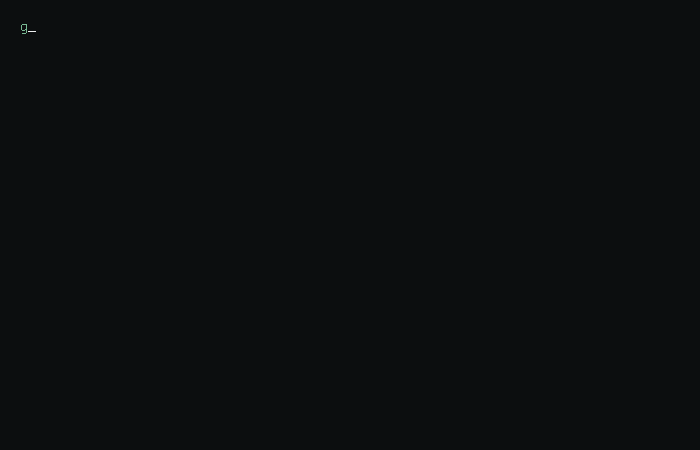

# Hi 👋, I'm Gordon 

  

  

---

### 🚀 About Me

<table align="center">
  <tr>
    <td width="50%" valign="top">
      <h4>🛠️ My Dev Stack</h4>
      <ul>
        <li>🌐 <b>Portfolio:</b> <a href="http://meklas.svpj.pl/">meklas.svpj.pl</a></li>
        <li>📧 <b>Contact:</b> <a href="mailto:meklasdev@gmail.com">meklasdev@gmail.com</a></li>
        <li>🏢 <b>Focus:</b> Creative Fullstack Solutions</li>
        <li>🇵🇱 <b>Location:</b> Poland</li>
      </ul>
    </td>
    <td width="50%" valign="top">
      <h4>🤝 Connect With Me</h4>
      

        
        
        
      

      <h4>⚡ Status</h4>
      
    </td>
  </tr>
</table>

---

### 📊 GitHub Activity & Stats

  

  

---

### 📁 Featured Projects

| Project | Description | Tech Stack |
| :--- | :--- | :--- |
| **[EduTrack](https://github.com/meklasdev/EduTrack)** | Advanced educational tracking system for students and teachers. |`JavaScript` `MySQL` |
| **[Mekta](https://github.com/meklasdev/mekta)** | Innovative platform for community interaction and management. | `JavaScript` `Node.js` `CSS` |

---

### 🧰 Languages and Tools

 
  

  

